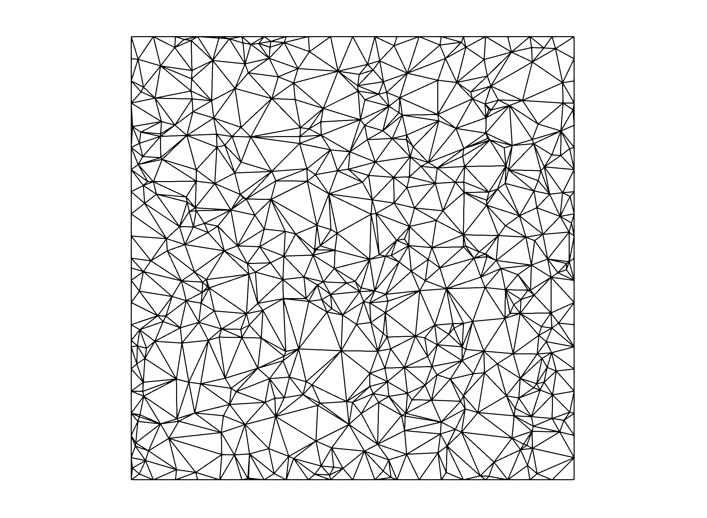

# README

初于个人练习的考虑，本仓库实现了一些数字几何处理的算法，涵盖网格简化、变形、优化、去噪、参数化等。

## 网格参数化（Parameterization）

网格参数化常用在渲染中，例如纹理，法向渲染等。下图从左到右依次为初始网格，Tutte's embedding，LSCM[1]，ABF++[2]的参数化结果。

    
     
 

## 网格简化（Simplification）

网格简化通常应用在（Level of Details, LOD）技术中，早期由于硬件条件限制，一些研究提出了串行的网格简化技术，下图展示了二次误差度量下的 Edge Collapse[3]，以及Progressive Meshes[4]还原。

    
    

    
    

## 网格去噪

通过扫描仪等得到的网格往往带有噪声。如何定义噪声，还原目标网格是网格去噪技术的核心。下图展示了经典网格双边去噪方法[5]。

    
    

    
    

## 网格优化

不同于网格去噪，网格优化的输入要求无噪声，初始网格由于剖分方法导致网格单元质量低下，需要进行质量优化的后处理。下图从左往右依次是初始网格，Xu06年关于距离二次度量方法，Renka16的关于面积的二次度量方法。

    
    

## 变形迁移

最经典的变形迁移方法 Deformation Transfer[8]对后续的关于动作捕捉等相关技术有着很大影响，但是步骤交互较为繁琐。

给定待变形网格 target，原网格 source 及其变形后的网格 deformed source。

通过交互固定变形网格 target 和 source 的部分对应点，通过将 target 变形为 source 需要两者的全局对应情况。衣服为 target，人体为 source。变形之后衣服与人体模型几乎重合，通过AABB树就能容易的寻找对应关系。通过对应关系进一步在迁移变形。

    
    

在衣服迁移应用中，为了使得衣服服装迁移到人体不同位置、形态中。在进行迁移时，需要至少约束一个点来确定方向和位置信息。

    
    

经过变形迁移，服装成功找到了变形后的模型（deformed source）方向。但是在衣服迁移的问题中，会出现相交的限制，参考Garment Transfer[9] [10]等文章的做法进行适应性拟合，结果如右图所示。

## 参考文献

[1]Least squares conformal maps for automatic texture atlas generation.

[2]ABF++: Fast and robust angle based flattening.

[3]Surface simplification using quadric error metrics.

[4]Progressive meshes.

[5]Bilateral mesh denoising.

[6]An angle-based optimization approach for 2D finite element mesh smoothing.

[7]Two simple methods for improving a triangle mesh surface.

[8]Deformation transfer for triangle meshes.

[9]Pose-independent garment transfer.

[10]DRAPE: DRessing Any PErson.

