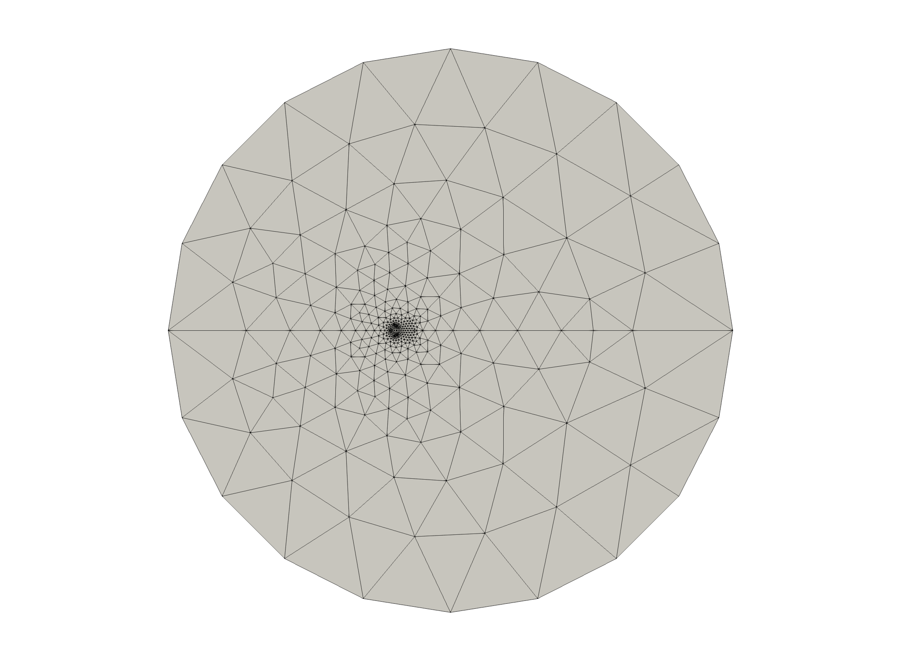

# README

初于个人练习的考虑，本仓库实现了一些数字几何处理的算法，涵盖网格简化、变形、优化、去噪、参数化等。

## 网格参数化

网格参数化常用在渲染中，例如纹理，法向渲染等。下图从左到右依次为初始网格，Tutte's embedding，LSCM[1]，ABF++[2]的参数化结果。

    
     
 

## 参考文献

[1]Least squares conformal maps for automatic texture atlas generation;

[2]ABF++: Fast and robust angle based flattening

