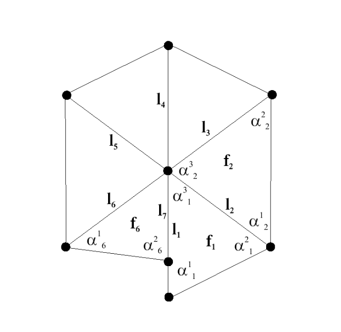
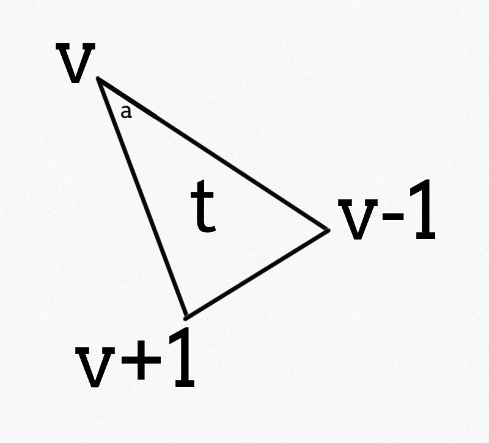

# Angle Based Flattening Plus Plus

## ABF 

**ABF** (The Angle Based Flattening) 方法的基于这样一个先验：2D 三角剖分 (**triangulation**) 可以由其角度集得到。基于此，**ABF** 通过在角度空间中参数化作为过渡，为从角度空间转换到 2D 坐标系提供了角度保证。

### Formulation

角度空间中的目标函数：
$$
E(\alpha)=\sum_{t \in T} \sum_{k=1}^{3} \dfrac{1}{w_{k}^{t}}\left(\alpha_{k}^{t}-\beta_{k}^{t}\right)^{2}, \tag{1}
$$
其中 $T$ 表示网格的三角形集合，$k$ 表示三角形的三个角的序号。 $\alpha_{k}^{t}$ 表示未知的平面角度，$\beta_{k}^{t}$ 表示对应的最优角度，$w_{k}^{t} = 1/\beta_{k}^{t}$ 。

还有一些约束保证平面参数化的准确性：

- 三角形有效性 (Triangle validity)：
  $$
  \forall t \in T, \quad C_{T r i}(t)=\alpha_{1}^{t}+\alpha_{2}^{t}+\alpha_{3}^{t}-\pi=0;\tag{2}
  $$

- 平面度 (Planarity)：
  $$
  \forall v \in V_{i n t}, \quad C_{P l a n}(v)=\sum_{(t, k) \in v^{*}} \alpha_{k}^{t}-2 \pi=0;\tag{3}
  $$
  其中 $V_{int}$ 表示所有的内部点，$v^{*}$ 表示顶点 $v$ 的邻接点。

- 重构 (Reconstruction)：
  $$
  \forall v \in V_{i n t}, \quad C_{L e n}(v)=\prod_{(t, k) \in v^{*}} \sin \alpha_{k \oplus 1}^{t}-\prod_{(t, k) \in v^{*}} \sin \alpha_{k \ominus 1}^{t}=0. \tag{4}
  $$
  其中 $\alpha_{k \oplus 1}^{t}$ 表示第 $t$ 个三角形的第 $k$ 个角的后一个邻接角，$\alpha_{k \ominus 1}^{t}$ 表示前一个角。这个约束目的是让每对邻接面共享的边的边长保持不变，详细见附录 $1$ 。

接下来，使用拉格朗日乘数法将约束引入到目标函数中求解，即：
$$
F(x)=F\left(\alpha, \lambda_{T r i}, \lambda_{P l a n}, \lambda_{L e n}\right)=E+\sum_{t} \lambda_{T r i}^{t} C_{T r i}(t)+\sum_{v} \lambda_{P l a n}^{v} C_{P l a n}(v)+\sum_{v} \lambda_{L e n}^{v} C_{L e n}(v).\tag{5}
$$

### ABF Solution Mechanism

显而易见地，重构项是非线性的。一般地，要求 $F(x)$ 的最小值，需要求出其一阶导数为 $0$ 的 $x$ 值，但是对于一个非线性问题，导数的零点大于 $1$ 。故线性的求解方法就不适用了，所以，论文中使用牛顿法解决这个非线性最小化问题 $F(x)$ 。

牛顿法的基本思想是，通过迭代的方法，使当前迭代值 $x^k$ 朝着使函数下降最快方向移动一定的步长 $\delta$ ，得到新的迭代值 $x^{k+1}=x^k+\delta$ ，然后开始新的迭代，直到迭代值使函数值足够小，这样当前的迭代值就是满足一定精度的最优解。

设当前迭代值为 $x^k$ ，且 $\|\nabla F(x^k)\|>\varepsilon$ ，其中 $\varepsilon$ 为给定趋近于零的精度，$\nabla$ 为梯度算子。问题就转换为找到一个下降方向 $\delta$ ，使得 $x^{k+1}=x^k+\delta$ 的梯度算子值 $\|\nabla F(x^{k+1})\|$ 逼近给定精度值 $\varepsilon$ 。

那么，在 $x^k$ 处泰勒二次展开：
$$
F(x) \approx F(x^k) + \nabla F(x^k)(x-x^k) + \dfrac{1}{2}(x-x^k)^T\nabla^2F(x^k)(x-x^k),\tag{6}
$$
为了找到在 $x^k$ 邻域内 $F(x)$ 的最小值，故对公式 $(6)$ 对 $x$ 求导得到：
$$
\nabla F(x) = 0 + \nabla F(x^k) + \nabla^2F(x^k)(x-x^k). \tag{7}
$$
为了最小化 $F(x)$ ，令 $\nabla F(x) = 0$ 并设 $(x-x^k) = \delta$ 则有：
$$
\nabla^2F(x^k)\delta = -\nabla F(x^k). \tag{8}
$$
故得到了求解该问题的一般形式：
$$
\begin{array}
\\\textbf{while} \quad \|\nabla F(x)\|>\varepsilon \\
\quad \textbf{solve}\quad \nabla^2F(x)\delta = -\nabla F(x). \\
\quad \quad x \leftarrow x + \delta \\ 
\textbf{end}
\end{array}
\tag{9}
$$
这样牛顿法就将非线性问题线性化了，传统求解线性方程 $\nabla^2F(x)\delta = -\nabla F(x)$ 使用 LU 分解即可。

关于 $\nabla F(x)$ 和 $\nabla^2 F(x)$ 的矩阵组成见附录 $2$ 。

### SPEEDING-UP ABF

公式 $(8)$ 的线性系统 $\nabla^{2} F(x) \delta=-\nabla F(x)$ ，可以通过分解成一些更小的问题来加速算法，使性能更好。

对公式 $(8)$ ：
$$
\left[\begin{array}{cc}
\Lambda & J^T \\
J & 0
\end{array}
\right]
\left[
\begin{array}{c}
\delta_{\alpha} \\ \delta_{\lambda}\end{array}\right]=\left[\begin{array}{l}b_{1} \\ b_{2}\end{array}\right], \tag{10}
$$
其中 $b_1 = -\nabla_{\alpha} F,b_2=-\nabla_{\lambda}F$ 。故可以写为：
$$
\begin{aligned} 
\Lambda \delta_{\alpha}+J^{T} \delta_{\lambda} &=b_{1} \\
J \delta_{\alpha} &=b_{2}.
\end{aligned} \tag{11}
$$
这样就可以得到分别对 $\delta_{\alpha},\delta_{\lambda}$  求解：

对公式 $(11)$ 上式乘以 $J\Lambda^{-1}$ 并减去下式求的 $\delta_{\lambda}$ ，再返带回上式得到：
$$
\begin{aligned} J \Lambda^{-1} J^{T} \delta_{\lambda} &=b^{*} \quad \text { where } \quad b^{*}=J \Lambda^{-1} b_{1}-b_{2} \\ \delta_{\alpha} &=\Lambda^{-1}\left(b_{1}-J^{T} \delta_{\lambda}\right) \end{aligned}. \tag{12}
$$
进一步的，在附录 $2$ 中 $J_1(n_f\times 3n_f)$ 的结构非常简单，且每行正交且线性无关。

将 $J$ 改写为 $\left[J_1, J_{2}\right]^T$ ，其中 $J_1=J_1,J_{2}=[J_2,J_3]^T$ 。
$$
J \Lambda^{-1} J^{t}=\left[\begin{array}{c}\Lambda^{*} J^{* t} \\ J^{*} J^{* *}\end{array}\right] \text { where }\left\{\begin{array}{l}\Lambda^{*}\left(n_{f} \times n_{f}\right)=J_{1} \Lambda^{-1} J_{1}^{t} \\ J^{*}\left(2 n_{i n t} \times n_{f}\right)=J_{2} \Lambda^{-1} J_{1}^{t} \\ J^{* *}\left(2 n_{i n t} \times 2 n_{i n t}\right)=J_{2} \Lambda^{-1} J_{2}^{t}\end{array}\right. \tag{13}
$$
这样可以在保持同样结构的 情况下，进一步缩小求解系统：
$$
\begin{array}{l}\Lambda^{*} \delta_{\lambda_{1}}+J^{* t} \delta_{\lambda_{2}}=b_{1}^{*} \\ J^{*} \delta_{\lambda_{1}}+J^{* *} \delta_{\lambda_{2}}=b_{2}^{*}\end{array}. \tag{14}
$$
其中 $\lambda_1 = \lambda_{Tri}, \lambda_2=\left[\lambda_{Plan},\lambda_{Len}\right]^T$ 。

将公式 $(14)$ 的上式乘以 $J^*\Lambda^{*-1}$ 减去下式消去 $\delta_{\lambda_1}$ 求出 $\delta_{\lambda_2}$ 返带入上式得：
$$
\begin{array}{c}
\left(J^{*} \Lambda^{*-1} J^{* T}-J^{* *}\right) \delta_{\lambda_{2}}=J^{*} \Lambda^{*-1} b_{1}^{*}-b_{2}^{*} \\
\delta_{\lambda_{1}}=\Lambda^{*-1}\left(b_{1}^{*}-J^{* t} \delta_{\lambda_{2}}\right)
\end{array}. \tag{15}
$$
综上所述，**ABF++** 求解系统为：
$$
\begin{array}
\\\textbf{while} \quad \|\nabla F(x)\|>\varepsilon \\
\quad \text{compute $b,J,\Lambda$} \\
\quad \text{solve Equation 15}\rightarrow \delta_{\lambda_2} \\
\quad \text{compute $\delta_{\lambda_1}$ Equation 15} \\ 
\quad \text{compute $\delta_{\lambda_{\alpha}}$ Equation 12} \\ 
\quad\lambda_{1} \leftarrow \lambda_{1}+\delta_{\lambda_{1}} \quad ; \quad \lambda_{2} \leftarrow \lambda_{2}+\delta_{\lambda_{2}} \quad ; \quad \alpha \leftarrow \alpha+\delta_{\alpha} \quad / * x=(\alpha, \lambda) * / \\
\textbf{end}
\end{array}
\tag{16}
$$
对比公式 $(9)$ 和公式 $(16)$ 求解系统的维度从 $(4n_f + 2n_{int})$ 减小到 $(2n_{int})$ 。

## 附录 $1$ 

如图所示：

根据正弦定理，对 $\mathbf{f}_1$ 有：$\dfrac{\mathbf{l}_1}{\sin{\alpha}_2^1}=\dfrac{\mathbf{l}_2}{\sin{\alpha}_1^1}$ 。同理，对 $\mathbf{f}_2$ 有：$\dfrac{\mathbf{l}_2}{\sin{\alpha}_2^2}=\dfrac{\mathbf{l}_3}{\sin{\alpha}_1^2}$ ，依次类推只到循环该点的一环领域，将相同的变量带入进去有：
$$
\dfrac{\sin{\alpha}_2^1}{\sin{\alpha}_1^1}\cdot\dfrac{\sin{\alpha}_2^2}{\sin{\alpha}_1^2}\cdot\dfrac{\sin{\alpha}_2^3}{\sin{\alpha}_1^3}\cdot\dfrac{\sin{\alpha}_2^4}{\sin{\alpha}_1^4}\cdot \dfrac{\sin{\alpha}_2^5}{\sin{\alpha}_1^5}\dfrac{\sin{\alpha}_2^6}{\sin{\alpha}_1^6}=1.
$$
据此，对任意一个内部点 $v$ 能得到一般公式：
$$
\forall v \in V_{i n t}, \quad C_{L e n}(v)=\prod_{(t, k_1) \in v^{*}} \sin \alpha_{k_1}^{t}-\prod_{(t, k_2) \in v^{*}} \sin \alpha_{k_2}^{t}=0,
$$
其中 $k_1$ 为以点 $v$ 为起点的三角形逆时针的下一个顶点对应的角， $k_2$ 为顺时针的下一个顶点对应的角。

## 附录 $2$ 

### $\nabla F(x)$ 

对于多元函数 $F(x)$ 有：
$$
\nabla F(x) = \left[\dfrac{\partial F}{\partial x_1},\cdots,\dfrac{\partial F}{\partial x_n}\right] \tag{2.1}
$$
其中 $n=4n_f+2n_{int}$ ，$3n_f$ 个角度值，$n_f+2n_{int}$ 个拉格朗日参数值。

易得 $\nabla_{\alpha} F(x) =\dfrac{\partial F}{\partial \alpha}= \left[\dfrac{\partial F}{\partial x_1},\cdots,\dfrac{\partial F}{\partial x_{3n_f}}\right]$ ，$\nabla_{\lambda} F(x) =\dfrac{\partial F}{\partial \lambda} =\left[\dfrac{\partial F}{\partial x_{3n_f + 1}},\cdots,\dfrac{\partial F}{\partial x_n}\right]$ 。

对 $\nabla_{\alpha} F(x)$ 有：
$$
\begin{align}
\nabla_{\alpha} F(x)_i = \dfrac{\partial F}{\partial \alpha_i} =& \dfrac{2}{w_{i}^{t}}\left(\alpha_{i}^{t}-\beta_{i}^{t}\right) +\lambda_{Tri}^t +\lambda_{Plan}^v - \lambda^{v\oplus 1}_{Len}\cos{\alpha^t_i}\prod_{(t^*,k\neq i)\in v\oplus 1}\sin{\alpha^{t^*}_k} \\
&+\lambda^{v\ominus 1}_{Len}\cos{\alpha^t_i}\prod_{(t^*,k\neq i)\in v\ominus 1}\sin{\alpha^{t^*}_k}.
\end{align}
$$
其中 $t$ 为包含角 $\alpha_i$ 的三角形，$v$ 为包含入射角 $\alpha_i$ 的顶点，$v\oplus 1$ 为三角形 $t$ 以 $v$ 为起点的逆时针下一个顶点，$v\ominus 1$ 为顺时针顶点：

$\nabla_{\lambda} F(x) = \left[\dfrac{\partial F}{\partial \lambda_{Tri}},\dfrac{\partial F}{\partial \lambda_{Plan}},\dfrac{\partial F}{\partial \lambda_{Len}}\right]$ 。易得：
$$
\begin{align}
\dfrac{\partial F}{\partial \lambda_{Tri}^{t_i}} &= C_{Tri}(t_i) ;\\
\dfrac{\partial F}{\partial \lambda^{v_i}_{Plan}} &= C_{Plan}(v_i); \\
\dfrac{\partial F}{\partial \lambda^{v_i}_{Len}} &= C_{Len}(v_i). \\
\end{align}
$$

### $\nabla^2 F(x)$

根据公式 $(2.1)$ 可得：
$$
\nabla^2F(x) = 
\begin{bmatrix}
\dfrac{\partial^2F}{\partial^2x_1}& \cdots & \dfrac{\partial^2 F}{\partial x_1\partial x_n} \\ 
 \vdots&  \ddots& \\ 
 \dfrac{\partial^2F}{\partial x_1\partial x_n}& \cdots &  \dfrac{\partial^2F}{\partial x_n\partial x_n}
\end{bmatrix}.
$$

将对 $\alpha$ 的偏导数分块即：
$$
\nabla^2F(x) = 
\begin{bmatrix}
\dfrac{\partial^2F}{\partial^2x_1}& \cdots &\dfrac{\partial^2 F}{\partial x_{3n_f}\partial x_1}& \cdots &\dfrac{\partial^2 F}{\partial x_n\partial x_1} \\ 
 \vdots&  \ddots& \vdots& \cdots & \vdots\\ 
\dfrac{\partial^2 F}{\partial x_1 \partial x_{3n_f}} & \cdots &  \dfrac{\partial^2 F}{\partial x_{3n_f} \partial x_{3n_f}} & \cdots & \dfrac{\partial^2 F}{\partial x_n \partial x_{3n_f}}\\
 \vdots&  & \vdots& \cdots & \vdots\\ 
\dfrac{\partial^2F}{\partial x_1\partial x_n}& & \cdots & &  \dfrac{\partial^2F}{\partial x_n\partial x_n}
\end{bmatrix}
$$
设 $\begin{bmatrix}
\dfrac{\partial^2F}{\partial^2x_1}& \cdots & \dfrac{\partial^2 F}{\partial x_{3n_f}\partial x_1} \\ 
 \vdots&  \ddots& \\ 
 \dfrac{\partial^2F}{\partial x_1\partial x_{3n_f}}& \cdots &  \dfrac{\partial^2F}{\partial^2 x_{3n_f}}
\end{bmatrix} = \mathbf{\Lambda}$ 。易知 $ \mathbf{\Lambda}= \dfrac{\partial^2 F}{\partial^2 \alpha}$ ，所以 故有：
$$
\dfrac{\partial^2 F}{\partial^2 \alpha} = \dfrac{\partial^2 E}{\partial^2 \alpha} = \mathbf{\Lambda},
$$
且 $\Lambda=\operatorname{diag}\left(\dfrac{2}{w_{k}^{t}}\right)$ 。

设 $\begin{bmatrix}
\dfrac{\partial^2F}{\partial x_1 \partial x_{3n_f+1}}& \cdots & \dfrac{\partial^2 F}{\partial x_{3n_f}\partial x_{3n_f+1}} \\ 
 \vdots&  \ddots& \\ 
 \dfrac{\partial^2F}{\partial x_1\partial x_{n}}& \cdots &  \dfrac{\partial^2F}{\partial x_{3n_f}\partial x_{n}}
\end{bmatrix} = \mathbf{J}$ ，故 $\begin{bmatrix}
\dfrac{\partial^2F}{\partial x_{3n_f+1} \partial x_1}& \cdots & \dfrac{\partial^2 F}{\partial x_n\partial x_1} \\ 
 \vdots&  \ddots& \\ 
 \dfrac{\partial^2F}{\partial x_{3n_f+1}\partial x_{3n_f}}& \cdots &  \dfrac{\partial^2F}{\partial x_n\partial x_{3n_f}}
\end{bmatrix} = \mathbf{J}^T$ 。

易知 $\mathbf{J} = \dfrac{\partial F}{\partial \lambda}\cdot\dfrac{\partial F}{\partial \alpha}$ ，已知 $\lambda = (\lambda_{Tri},\lambda_{Plan},\lambda_{Len})^T$ ，同样 $\mathbf{J} = (\mathbf{J}_1,\mathbf{J}_2,\mathbf{J}_3)^T$ 。

 $\mathbf{J}_1 = \dfrac{\partial F}{\partial \lambda_{Tri}}\cdot\dfrac{\partial F}{\partial \alpha}$ ， $\mathbf{J}_2 = \dfrac{\partial F}{\partial \lambda_{Plan}}\cdot\dfrac{\partial F}{\partial \alpha}$ ， $\mathbf{J}_3 = \dfrac{\partial F}{\partial \lambda_{Len}}\cdot\dfrac{\partial F}{\partial \alpha}$ 。

对 $\mathbf{J}_1 = \dfrac{\partial F}{\partial \lambda_{Tri}}\cdot\dfrac{\partial F}{\partial \alpha} = \dfrac{\partial C_{Tri}}{\partial \alpha}$ ：
$$
\mathbf{J}_{1}=\left[\begin{array}{ccc}
111 & & &000 \\
& 111 & \\
&  & \ddots& \\
000 &  & & 111
\end{array}\right],
$$
且 $\mathbf{J}_1$ 矩阵大小为 $n_f \times 3n_f$ 。

同样 $\mathbf{J}_2 = \dfrac{\partial F}{\partial \lambda_{Plan}}\cdot\dfrac{\partial F}{\partial \alpha} = \dfrac{\partial C_{Plan}}{\partial \alpha}$ ，对每个内部点 $v$ 有：
$$
\left\{
\begin{align}
 &\mathbf{J}_{ik}=1 ,\quad \text{if the angle k is the set of angles incident on vertex $v_i$;}\\ 
 &\mathbf{J}_{ik}=0 ,\quad \text{otherwise}. 
\end{align}\right.
$$
故 $\mathbf{J}_2$ 矩阵大小为 $n_{int} \times 3n_f$ 。

最后，对 $\mathbf{J}_3$ ：
$$
\left\{
\begin{align}
&\mathbf{J}_{ik}=\cos{\alpha^t_{k^*}}\prod_{(t, k\neq k^*)\in v_i}\sin\alpha^t_k, \quad \mathbf{J}_{ik} = \dfrac{\partial C_{Len}(v_i)}{\partial \alpha^t_{k^*}};\\ 
 &\mathbf{J}_{ik}=0 \quad \text{otherwise}. 
\end{align}\right.
$$
同样 $\mathbf{J}_3$ 矩阵大小为 $n_{int} \times 3n_f$ 。

剩余右下角的矩阵块$\begin{bmatrix}
\dfrac{\partial^2 F}{\partial^2x_{3n_f + 1}}&  &  \\ 
 &  \ddots& \\ 
 &  &  \dfrac{\partial^2F}{\partial^2 x_n}
\end{bmatrix}=\dfrac{\partial^2 F}{\partial^2 \lambda}=0$ ，故 $\nabla^2F(x)$ 能写成：
$$
\nabla^2F(x) =
\begin{bmatrix}
\mathbf{\Lambda} & \mathbf{J}^T \\
\mathbf{J} & \mathbf{0}
\end{bmatrix} = 
\begin{bmatrix}

&\mathbf{\Lambda} & \mathbf{J}_1 & \mathbf{J}_2 & \mathbf{J}_3 \\
& \mathbf{J}_1 &\mathbf{0} &\mathbf{0} & \mathbf{0}\\
& \mathbf{J}_2 &\mathbf{0} &\mathbf{0} & \mathbf{0}\\
& \mathbf{J}_3 &\mathbf{0} &\mathbf{0} & \mathbf{0} 
\end{bmatrix}.
$$

