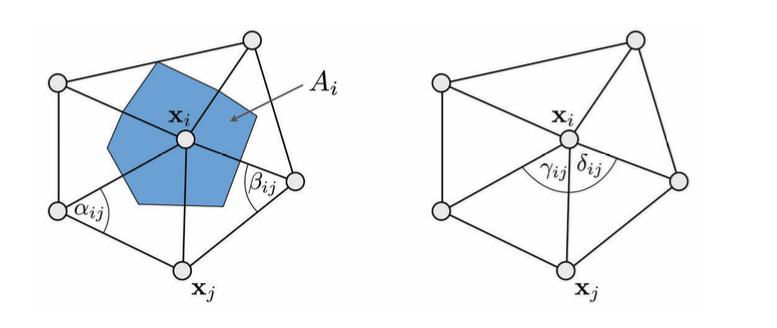

# Barycentric Mapping, Tutte's embedding

## 方法描述

给定带边界的三角网格 $M$ 满足跟圆盘同胚 ，将网格的边界点 $V_{bod}$ 按顺序的设置在凸多边形上（这里用圆实现）。对每个内点 $v\in V_{int}$ 设置为邻接点凸组合，即
$$
\forall v_i=(u_i,v_i)^T\in V_{int}:-w_{ii}v_i=\sum_{j\neq i}w_{ij}v_j,
$$
其中 $w_{ii}+\sum_{j\neq i}w_{ij} =0$ 。

这里的权值可以采用不同的离散化方法：

- Uniform：权重设为 1；
- COT/Harmonic：$a_{i, j}=\frac{1}{2 A_{i}}\left(\cot \alpha_{i, j}+\cot \beta_{i, j}\right)$ ；

- Mean Value：$a_{i, j}=\frac{1}{\left\|\mathbf{x}_{i}-\mathbf{x}_{j}\right\|}\left(\tan \left(\frac{\delta_{i, j}}{2}\right)+\tan \left(\frac{\gamma_{i, j}}{2}\right)\right)$

## 实现

根据描述，求解的矩阵形式为：
$$
\mathbf{A}\mathbf{u}=\mathbf{0},
$$
其中分解 $\mathbf{A}=[\mathbf{A}_{int},\mathbf{A}_{bod}],\mathbf{u}=[\mathbf{u}_{int},\mathbf{u}_{bod}]$ ，则求解系统为：
$$
\mathbf{A}_{int}\mathbf{u}_{int}=-\mathbf{A}_{bod}\mathbf{u}_{bod}.
$$
