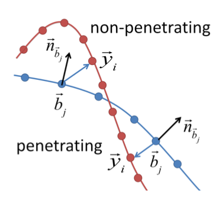

# Garment Transfer

## Deformation Transfer

### Correspond

给定源网格和目标网格，通过变形的方法，将源网格逼近到目标网格，最后通过计算最近点来找到两个网格之间的对应关系[1]。

给定源网格 $M_{src}$ 目标网格 $M_{tat}$ ，其中源网格顶点表示为 $\{v_1,\cdots,v_n\}$  。一个映射 $Map_{src2tat}$ ，其中每对映射表示约束点，约束源网格的变形。设变形后的源网格顶点为 $\{\tilde{v}_1,\cdots,\tilde{v}_n\}$  ，故 $\mathbf{T}_i$ 表示为第 $i$ 个面的变形的仿射变换矩阵。故优化方程为：
$$
\begin{array}{cc}
\min_{\tilde{\mathbf{v}}_{1} \ldots \tilde{\mathbf{v}}_{n}} & E\left(\mathbf{v}_1 \cdots \mathbf{v}_{n}, \mathbf{c}_{1 \cdots} \mathbf{c}_{n}\right)=w_{S} E_{S}+w_{I} E_{I}+w_{C} E_{C} \\
& \text { subject to } \quad \tilde{\mathbf{v}}_{s_{k}}=\mathbf{m}_{k}, \quad k \in 1 \ldots m
\end{array}
$$
其中 $S_k$ 表示源网格顶点序号，$\mathbf{m}_{k}$ 表示映射 $k$ 下目标网格的顶点值。

第一项：
$$
E_{S}\left(\mathbf{v}_{1} \ldots \mathbf{v}_{n}\right)=\sum_{i=1}^{|T|} \sum_{j \in \operatorname{adj}(i)}\left\|\mathbf{T}_{i}-\mathbf{T}_{j}\right\|_{F}^{2},
$$
表示对于源网格的每个面 ($|T|$) 的邻接面的变换要与该面的变化保持一致。

拆解： $\left\|\mathbf{T}_{i}-\mathbf{T}_{j}\right\|_{F}^{2} = \sum_k^{3}\left\|\mathbf{w_k}^T\mathbf{\tilde{V}_{ij}}\right\|^2_2.$

其中 $\mathbf{w_k}^T$ 由根据三角形 $i,j$ 计算得到，$\mathbf{\tilde{V}_{ij}}$ 是三角形 $i,j$ 的所有变形后顶点（每个三角形 $4$ 个）。

第二项：
$$
E_{I}\left(\mathbf{v}_{1} \ldots \mathbf{v}_{n}\right)=\sum_{i=1}^{|T|}\left\|\mathbf{T}_{i}-\mathbf{I}\right\|_{F}^{2},
$$
这一项是约束第一项。

拆解：$\left\|\mathbf{T}_{i}-\mathbf{I}\right\|_{F}^{2} =\sum_k^{3}\left\|\mathbf{w_k}^T\mathbf{\tilde{V}_{i}} - \mathbf{i}\right\|^2_2. $ 

其中 $\mathbf{w_k}^T$ 由根据三角形 $i$ 计算得到，$\mathbf{\tilde{V}_{i}}$ 是三角形 $i$  的 $4$ 个顶点。

#### Initialization

第一步，设 $w_C = 0$ 。只通过第一项和第二项求出变形源网格的顶点初始值。

根据第一、二项。能将只含有第一、二项的优化方程写为以下形式：
$$
\min_{\tilde{\mathbf{v}}_{1} \ldots \tilde{\mathbf{v}}_{n}} E = w_S\left\|\mathbf{A}_S\mathbf{\tilde{V}}\right\|^2_2 + w_I\left\|\mathbf{A}_I\mathbf{\tilde{V}} - \mathbf{i}\right\|^2_2. \tag{1}
$$
考虑约束点：
$$
\sum_{k=1}^m w_M \left\|v_k-m_k\right\|^2,
$$
加入到公式 $(1)$ 中：
$$
\min_{\tilde{\mathbf{v}}_{1} \ldots \tilde{\mathbf{v}}_{n}} E = w_S\left\|\mathbf{A}_S\mathbf{\tilde{V}}\right\|^2_2 + w_I\left\|\mathbf{A}_I\mathbf{\tilde{V}} - \mathbf{i}\right\|^2_2 + 
w_M\left\|\mathbf{A}_M\mathbf{\tilde{V}} - \mathbf{m}\right\|.\tag{2}
$$
根据**向量和矩阵的求导公式**（见附录 $1$）。对能量函数 $E$ 求导有：
$$
\dfrac{\partial E}{\partial\mathbf{\tilde{V}}} = 2w_S\mathbf{A}_S^T\mathbf{A}_S\mathbf{\tilde{V}} + 2w_I(\mathbf{A}_I^T\mathbf{A}_I\mathbf{\tilde{V}} - \mathbf{A}_I^T\mathbf{i}) + 2w_M(\mathbf{A}_M^T\mathbf{A}_M\mathbf{\tilde{V}} - \mathbf{A}_M^T\mathbf{m}).
$$
令 $\dfrac{\partial E}{\partial\mathbf{\tilde{V}}} = 0$ ，有：
$$
(w_S\mathbf{A}_S^T\mathbf{A}_S + w_I\mathbf{A}_I^T\mathbf{A}_I + w_M\mathbf{A}_M^T\mathbf{A}_M)\mathbf{\tilde{V}} = w_I\mathbf{A}_I^T\mathbf{i}+w_M\mathbf{A}_M^T\mathbf{m}.
$$

#### The Third Term $E_C$ 

已知初始化求出的变形后的源网格顶点值。对每个顶点，通过 **AABB** 树找到目标网格上最近有效点。那么第三项的目标就是使源网格顶点逼近这些有效点：
$$
E_{C}\left(\mathbf{v}_{1} \ldots \mathbf{v}_{n}, \mathbf{c}_{1} \ldots \mathbf{c}_{n}\right)= w_C\sum_{i=1}^{n}\left\|\mathbf{v}_{i}-\mathbf{c}_{i}\right\|^{2}, \tag{3}
$$
同样的第三项写成矩阵形式：
$$
E_C = w_C\left\|\mathbf{A}_C \mathbf{\tilde{V}}-\mathbf{c}\right\|^2_2,
$$
因为第三项隐含了约束 $\tilde{\mathbf{v}}_{s_{k}}=\mathbf{m}_{k}, \quad k \in 1 \ldots m$ 。故联合公式 $(1)$ $(2)$ 有：
$$
\min_{\tilde{\mathbf{v}}_{1} \ldots \tilde{\mathbf{v}}_{n}} E = w_S\left\|\mathbf{A}_S\mathbf{\tilde{V}}\right\|^2_2 + w_I\left\|\mathbf{A}_I\mathbf{\tilde{V}} - \mathbf{i}\right\|^2_2 + 
w_C\left\|\mathbf{A}_C \mathbf{\tilde{V}}-\mathbf{c}\right\|^2_2. \tag{4}
$$
令 $\dfrac{\partial E}{\partial\mathbf{\tilde{V}}} = 0$ ，有：
$$
(w_S\mathbf{A}_S^T\mathbf{A}_S + w_I\mathbf{A}_I^T\mathbf{A}_I + w_C\mathbf{A}_C^T\mathbf{A}_C)\mathbf{\tilde{V}} = w_I\mathbf{A}_I^T\mathbf{i}+w_C\mathbf{A}_C^T\mathbf{c}. \tag{5}
$$
为了逼近目标网格，得到更好的结果，通过 $4$ 步迭代增加 $w_C\in[1.0,5000.0]$ 的值来求解公式 $(5)$ ，并在每次迭代更新有效点的值。

#### Find Correspond

已知由公式 $(5)$ 得到的变形后的源网格。  对变形后的源网格的每个三角形，通过 **AABB** 树找到目标网格最近点所属的三角形，即为一组映射，直到变形后的源网格每个三角形都有对应。

### Transfer

通过对应关系找到了，源网格与目标网格的映射关系 $M$ 。

已知源网格和其变形网格，其每个三角形的仿射变换表示为 $\mathbf{S}_{s_j}$ 。同样地，对与要迁移目标的网格及其所要求的结果，设仿射变换为 $\mathbf{T}_{t_j}$ ，则迁移的优化方程为：
$$
\min _{\tilde{\mathbf{v}}_{1} \ldots \tilde{\mathbf{v}}_{n}} \sum_{j=1}^{|M|}\left\|\mathbf{S}_{s_{j}}-\mathbf{T}_{t_{j}}\right\|_{F}^{2}
$$
其中 $\{{\tilde{\mathbf{v}}_{1} \ldots \tilde{\mathbf{v}}_{n}} \}$ 是要求的目标网格变形后的结果。

对每一项 $\left\|\mathbf{S}_{s_{j}}-\mathbf{T}_{t_{j}}\right\|^2_F$ ，能把它写成  $\left\|\mathbf{S}_{s_{j}}-\mathbf{A_{t_j}}\mathbf{\tilde{V}_{t_j}}\right\|^2_F$ ，对于 $\mathbf{\tilde{x}},\mathbf{\tilde{y}},\mathbf{\tilde{z}}$ 任一坐标有：
$$
\min _{\tilde{\mathbf{v}}_{1} \ldots \tilde{\mathbf{v}}_{n}}\|\mathbf{s}-\mathbf{A} \tilde{\mathbf{x}}\|_{2}^{2}. \tag{6}
$$
约束一点 $c$ 用于网格的位置变换。

## Refining The Fit

给定一个源人体模型和与之契合衣服（不自交），**Garment Transfer** 的目的是将衣服迁移到目标人体模型上。通过 **Deformation Transfer** ，得到的结果往往有衣服和目标人体模型自交的情况。为了解决这一问题，采用[2]中的网格拟合算法来解决自交问题：

### Cloth-body interpenetration

如图所示：

对衣服上的顶点，以其在目标人体模型的最近点在该点的法向的投影为度量，惩罚相交的节点：
$$
p_{\mathcal{C}}(\mathcal{Y})=\sum_{(i, j) \in \mathcal{C} \wedge i \in \mathcal{P}}\left\|\epsilon+\vec{n}_{\bar{b}_{j}}^{T}\left(\vec{y}_{i}-\vec{b}_{j}\right)\right\|^{2}, \tag{7}
$$
其中 $\mathcal{C}$ 是每个衣服顶点 $\vec{y}_{i}$ 和其在目标人体模型的最近点 $\vec{b}_{j}$ 的映射，$\vec{n}_{\bar{b}_{j}}^{T}$ 则为该最近点的法向，$\epsilon$ 是惩罚常数，表示衣服顶点沿法向变形的长度。

对于每对映射 $(i,j)$ ：$\left\|\epsilon+\vec{n}_{\bar{b}_{j}}^{T}\left(\vec{y}_{i}-\vec{b}_{j}\right)\right\|^{2} = \left\|\vec{n}_{\bar{b}_{j}}^{T}\vec{y}_{i}-(\vec{n}_{\bar{b}_{j}}^{T}\vec{b}_{j} - \epsilon)\right\|^{2}=\left\|\vec{n}_{\bar{b}_{j}}^{T}\vec{y}_{i}-e\right\|^{2}$ ，故对衣服顶点集 $\mathbf{V}$ ，该项写成矩阵形式为：
$$
p_{\mathcal{C}} = \left\|\mathbf{A}_{p_{\mathcal{C}}}\mathbf{V}-\mathbf{e}\right\|^2. \tag{8}
$$

### Smooth warping

为了使上述变形平滑化，该论文采用约束每个顶点的改变量的方法：
$$
s(\mathcal{Y})=\sum_{i \in \mathbf{V}}\left\|\left(\vec{y}_{i}-\tilde{\vec{y}}_{i}\right)-\frac{1}{\left|\mathbf{N}_{i}\right|} \sum_{j \in \mathbf{N}_{i}}\left(\vec{y}_{j}-\tilde{\vec{y}}_{j}\right)\right\|^{2}, \tag{9}
$$
其中 $\mathbf{V}$ 表示衣服的顶点集，$\mathbf{N}_{i}$ 表示衣服顶点 $\vec{y}_{i}$ 的邻接点，$\tilde{\bar{y}}_{i}$ 是点 $i$ 在未变形前的值。

设顶点 $\tilde{\bar{y}}_{i}$ 的变形程度：$\tilde{\bar{y}}_{i} - \dfrac{1}{\left|\mathbf{N}_{i}\right|} \sum_{j \in \mathbf{N}_{i}}\tilde{\bar{y}}_{j}=\Delta \tilde{\bar{y}}_{i}$ ，故公式 $(9)$ 写作：
$$
s(\mathcal{Y})=\sum_{i \in \mathbf{V}}\left\|\vec{y}_{i} - \dfrac{1}{\left|\mathbf{N}_{i}\right|} \sum_{j \in \mathbf{N}_{i}}\vec{y}_{j}-\Delta \tilde{\bar{y}}_{i}\right\|^{2}=\left\|\mathbf{A}_{s(\mathcal{Y})}\mathbf{V}-\Delta 
\mathbf{\tilde{\vec{y}}}\right\|^2.\tag{10}
$$

### Damping

最后通过约束顶点来使弯曲点（不相交点）尽可能保持不变：
$$
d(\mathcal{Y})=\sum_{i \in \mathbf{V}}\left\|\vec{y}_{i}-\tilde{\vec{y}}_{i}\right\|^{2}.\tag{11}
$$
同理对该项有：
$$
d(\mathcal{Y})=\left\|\mathbf{A}_{d(\mathcal{Y})}\mathbf{V}-\mathbf{\tilde{\vec{y}}} \right\|^2. \tag{12}
$$
关于这三项的矩阵拆解见附录 $2$ 。

### Solve

最终的优化的目标为：
$$
E(\mathcal{Y})=p_{\mathcal{C}}(\mathcal{Y})+\lambda_{s} s(\mathcal{Y})+\lambda_{d} d(\mathcal{Y}).
$$
令 $\dfrac{\partial E(\mathcal{Y})}{\partial \mathcal{Y}} = 0$ 有：
$$
(A_{p_{\mathcal{C}}}^TA_{p_{\mathcal{C}}}+\lambda_s\mathbf{A}_{s(\mathcal{Y})}^T\mathbf{A}_{s(\mathcal{Y})}+\lambda_d\mathbf{A}_{d(\mathcal{Y})}^T\mathbf{A}_{d(\mathcal{Y})})\mathbf{V} = (A_{p_{\mathcal{C}}}^T\mathbf{e}+\lambda_s\mathbf{A}_{s(\mathcal{Y})}^T\Delta 
\mathbf{\tilde{\vec{y}}}+\lambda_d\mathbf{A}_{d(\mathcal{Y})}^T\mathbf{\tilde{\vec{y}}}).\tag{13}
$$
按照论文[2]的经验，迭代地将得到的结果作为输入，通过 $3$ 次迭代能得到良好的结果。其中 $\lambda_s = 4,2,1$ 以及 $\lambda_d = 0.8,0.6,0.4$ 。

## 附录 $1$ 

设 $f(\mathbf{x}) = \left\|\mathbf{A}\mathbf{x} - \mathbf{b}\right\|^2_2,\mathbf{x}\in \mathbb{R}^n.$

故 $f(\mathbf{x}) = (\mathbf{A}\mathbf{x} - \mathbf{b})^T (\mathbf{A}\mathbf{x} - \mathbf{b}) \Leftrightarrow f(\mathbf{x})=\mathbf{x}^T\mathbf{A}^T\mathbf{A}\mathbf{x} - \mathbf{x}^T\mathbf{A}^T\mathbf{b}-\mathbf{b}^T\mathbf{A}\mathbf{x}+\mathbf{b}^T\mathbf{b}.$

已知 $\dfrac{\partial \mathbf{x}^{T} \mathbf{a}}{\partial \mathbf{x}}=\dfrac{\partial \mathbf{a}^{T} \mathbf{x}}{\partial \mathbf{x}}=\mathbf{a}$ ，$\dfrac{\partial \mathbf{x}^{\top} \mathbf{A} \mathbf{x}}{\partial \mathbf{x}}=\left(\mathbf{A}+\mathbf{A}^{\top}\right) \mathbf{x}$ 。故有：
$$
f'(\mathbf{x})=2\mathbf{A}^T\mathbf{A}\mathbf{x} - 2\mathbf{A}^T\mathbf{b}.
$$

## 附录 $2$

设 $\vec{y}_{i} = (x_i,y_i,z_i)^T$ ，则 $\mathbf{V} = (\vec{y}_{1},\cdots,\vec{y}_{n})^T$ 。

对于第一项，每个平方项都是与顶点每个坐标的线性组合 $\mathbf{w}^T\vec{y}_{i}$ 。但是第二项和第三项与第一项不同：每个平方项是只含单个坐标。故有：
$$
\begin{bmatrix}
w_{x_i} & 0   & 0\\ 
 0  & w_{y_i} & 0\\ 
 0  & 0   & w_{z_i}
\end{bmatrix}
\begin{bmatrix}
x_i\\ 
y_i\\ 
z_i
\end{bmatrix}
$$
这样就可以统一三项公式，一同求解。

## 参考

[1] Sumner, R.W. et al. 2004. Deformation transfer for triangle mesh- es. ACM Trans. Graph. 23, 3.

[2] Guan, P. et. al. 2012. DRAPE: DRessing Any PErson. ACM Trans. Graph. 31, 4.